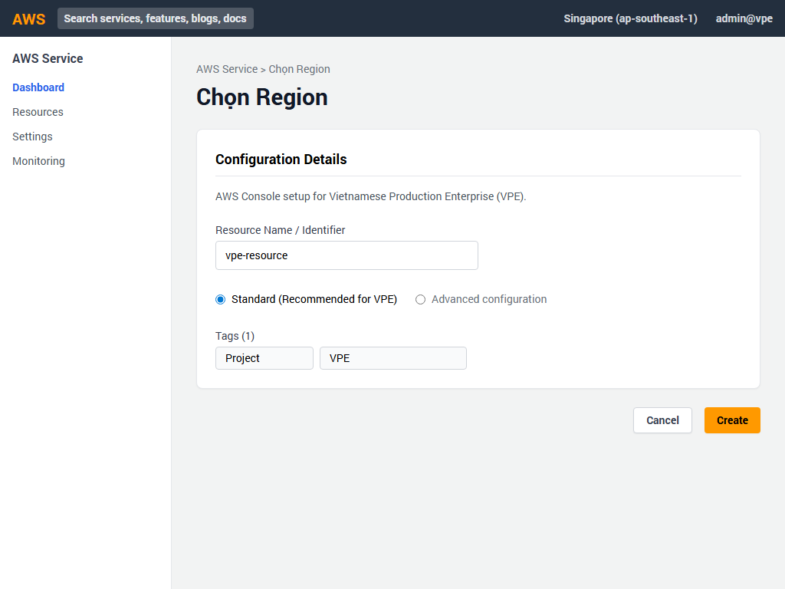
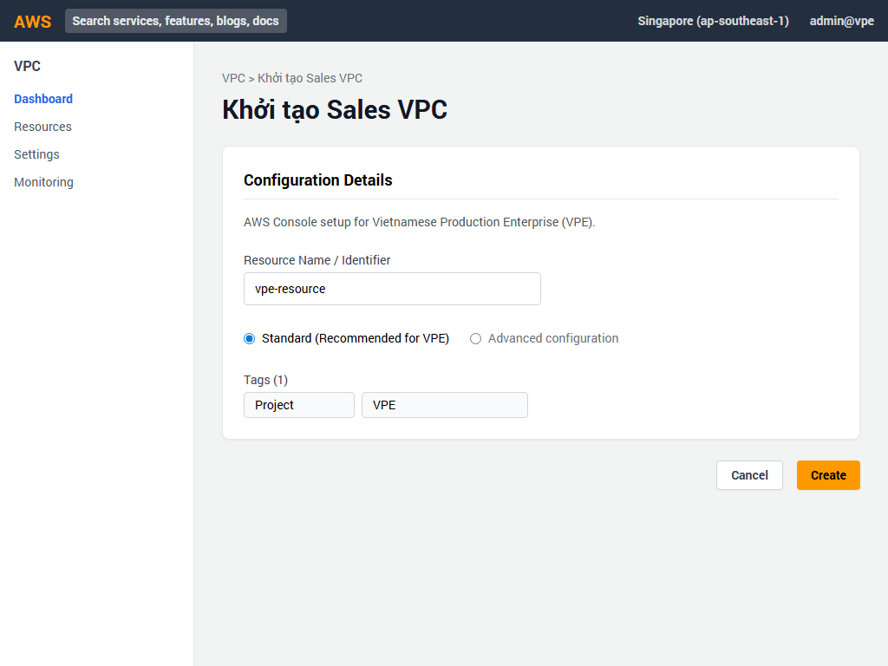
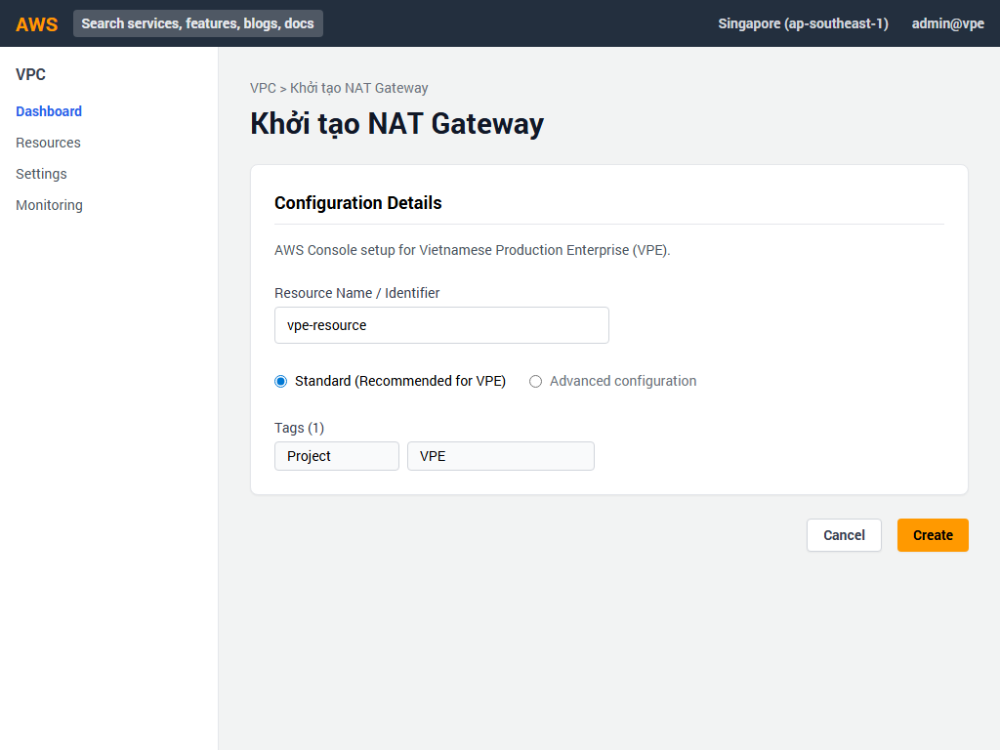
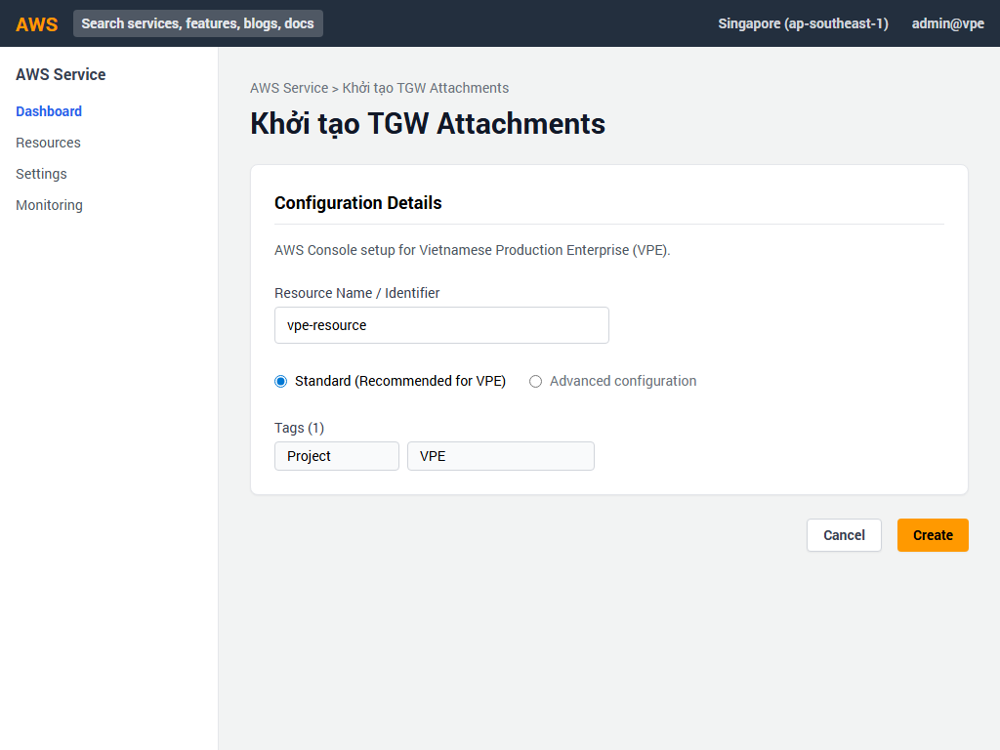
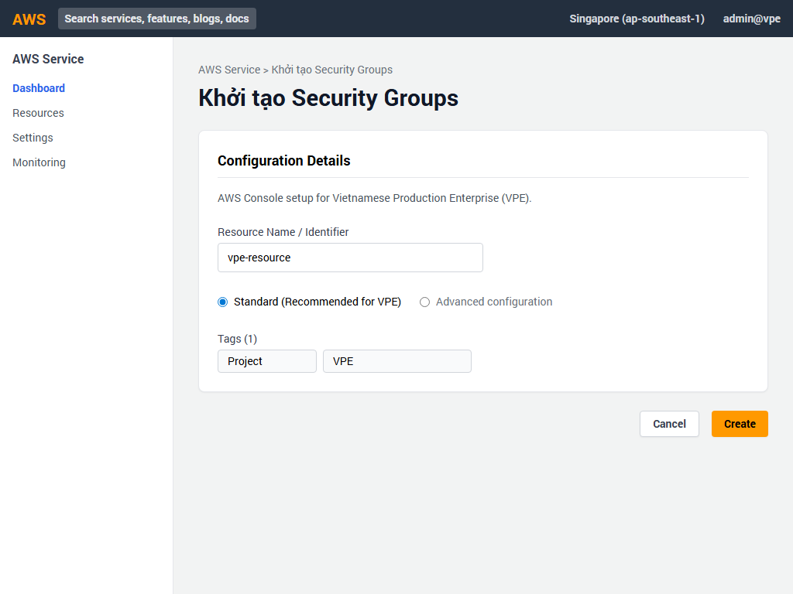

# Hướng dẫn Triển khai AWS Console - PHẦN 1: MẠNG & BẢO MẬT (Dự án VPE)

Dự án: **Vietnamese Production Enterprise (VPE)**

Hướng dẫn này cung cấp từng bước chi tiết để triển khai Hạ tầng Mạng và Bảo mật cơ bản cho dự án VPE thông qua giao diện AWS Management Console.

---

## Bước 1: Đăng nhập & Chọn Region

1. Truy cập vào [AWS Management Console](https://console.aws.amazon.com/).
2. Đăng nhập bằng tài khoản Quản trị viên (Administrator).
3. Ở góc trên cùng bên phải, nhấp vào menu thả xuống chọn Region.
4. Chọn **Asia Pacific (Singapore) ap-southeast-1**. Đây là Region chính của dự án VPE.

---

## Bước 2: Khởi tạo Core VPC

Core VPC là trung tâm mạng của hệ thống.

1. Chuyển đến dịch vụ **VPC** thông qua thanh tìm kiếm.
2. Nhấp vào nút màu cam **Create VPC**.
3. Trong biểu mẫu khởi tạo, thiết lập các trường sau:
   - **Resources to create**: Chọn `VPC only`.
   - **Name tag**: Nhập `vpe-prod-core-vpc`.
   - **IPv4 CIDR block**: Chọn `IPv4 CIDR manual input` và nhập `10.0.0.0/16`.
   - **IPv6 CIDR block**: Chọn `No IPv6 CIDR block`.
   - **Tenancy**: Chọn `Default`.
4. Cuộn xuống dưới cùng và nhấp vào nút **Create VPC**.

---

## Bước 3: Khởi tạo Sales VPC

Sales VPC dành riêng cho các ứng dụng và dịch vụ bán hàng.

1. Quay lại trang danh sách VPC và nhấp lại vào **Create VPC**.
2. Thiết lập các trường:
   - **Resources to create**: Chọn `VPC only`.
   - **Name tag**: Nhập `vpe-prod-sales-vpc`.
   - **IPv4 CIDR block**: Nhập `10.1.0.0/16`.
3. Nhấp vào nút **Create VPC**.

---

## Bước 4: Khởi tạo IoT VPC

IoT VPC được sử dụng cho việc thu thập và xử lý dữ liệu từ các thiết bị.

1. Tiếp tục nhấp vào **Create VPC**.
2. Thiết lập các trường:
   - **Resources to create**: Chọn `VPC only`.
   - **Name tag**: Nhập `vpe-prod-iot-vpc`.
   - **IPv4 CIDR block**: Nhập `10.2.0.0/16`.
3. Nhấp vào nút **Create VPC**.

---

## Bước 5: Khởi tạo Subnets cho Core VPC

Bây giờ chúng ta sẽ phân chia Core VPC thành các mạng con.

1. Ở menu bên trái của VPC Console, chọn **Subnets**.
2. Nhấp vào **Create subnet**.
3. Chọn VPC ID của `vpe-prod-core-vpc`.
4. Lần lượt thêm mới các subnet sau bằng cách nhấp **Add new subnet**:
   - **Tên**: `vpe-core-public-1a` | **AZ**: `ap-southeast-1a` | **CIDR**: `10.0.1.0/24`
   - **Tên**: `vpe-core-public-1b` | **AZ**: `ap-southeast-1b` | **CIDR**: `10.0.2.0/24`
   - **Tên**: `vpe-core-app-subnet-1a` | **AZ**: `ap-southeast-1a` | **CIDR**: `10.0.10.0/24`
   - **Tên**: `vpe-core-app-subnet-1b` | **AZ**: `ap-southeast-1b` | **CIDR**: `10.0.11.0/24`
   - **Tên**: `vpe-core-db-subnet-1a` | **AZ**: `ap-southeast-1a` | **CIDR**: `10.0.20.0/24`
   - **Tên**: `vpe-core-db-subnet-1b` | **AZ**: `ap-southeast-1b` | **CIDR**: `10.0.21.0/24`
5. Nhấp nút **Create subnet** ở dưới cùng để tạo toàn bộ các mạng con.

---

## Bước 6: Khởi tạo Internet Gateway

Thiết lập cổng kết nối internet cho các subnet công cộng.

1. Ở menu bên trái, chọn **Internet gateways**.
2. Nhấp vào **Create internet gateway**.
3. Tại **Name tag**, nhập `vpe-prod-igw`.
4. Nhấp nút **Create internet gateway**.
5. Sau khi tạo xong, một thông báo màu xanh lá sẽ xuất hiện. Nhấp vào nút **Actions** góc trên phải và chọn **Attach to VPC**.
6. Chọn `vpe-prod-core-vpc` từ danh sách và xác nhận **Attach internet gateway**.

---

## Bước 7: Khởi tạo NAT Gateway

Cung cấp kết nối internet một chiều cho các subnet riêng tư.

1. Trong menu bên trái, chọn **NAT gateways**.
2. Nhấp vào **Create NAT gateway**.
3. Cấu hình các mục sau:
   - **Name**: `vpe-prod-nat-gw`
   - **Subnet**: Chọn mạng con `vpe-core-public-1a`
   - **Connectivity type**: Chọn `Public`
   - **Elastic IP allocation ID**: Nhấp vào nút **Allocate Elastic IP** để tự động cấp phát một IP tĩnh.
4. Cuộn xuống và nhấp **Create NAT gateway**. (Sẽ mất vài phút để NAT Gateway chuyển sang trạng thái Available).

---

## Bước 8: Cấu hình Route Tables

Thiết lập bảng định tuyến để điều hướng lưu lượng mạng.

1. Truy cập **Route tables** ở menu bên trái.
2. **Cấu hình Public Route Table**:
   - Chọn Route table liên kết với Core VPC. Sửa tên thành `vpe-core-public-rt`.
   - Nhấp vào tab **Routes** dưới cùng, chọn **Edit routes**.
   - Thêm một route: Destination là `0.0.0.0/0`, Target chọn Internet Gateway `vpe-prod-igw`. Nhấp **Save changes**.
   - Chuyển sang tab **Subnet associations**, nhấp **Edit subnet associations** và chọn 2 subnet `vpe-core-public-1a` & `vpe-core-public-1b`. Lưu lại.
3. **Tạo Private Route Table**:
   - Nhấp **Create route table**, nhập tên `vpe-core-private-rt`, chọn `vpe-prod-core-vpc`. Nhấp **Create**.
   - Chỉnh sửa phần Routes: Thêm `0.0.0.0/0`, Target chọn NAT Gateway `vpe-prod-nat-gw`. Nhấp **Save changes**.
   - Liên kết các subnet App và DB vào Private Route Table này.

---

## Bước 9: Khởi tạo Transit Gateway

Kết nối tập trung các VPC lại với nhau.

1. Cuộn menu bên trái xuống mục **Transit gateways** và nhấp chọn.
2. Nhấp vào **Create transit gateway**.
3. Thiết lập thông số:
   - **Name tag**: Nhập `vpe-prod-tgw`.
   - **Amazon side ASN**: Nhập `64512`.
   - Trong phần cấu hình chi tiết, đảm bảo rằng tùy chọn **DNS support** được đánh dấu (Enable).
4. Nhấp nút màu cam **Create transit gateway**. (Chờ 2-5 phút để trạng thái chuyển thành Available).

---

## Bước 10: Gắn (Attach) các VPC vào Transit Gateway

1. Chọn **Transit gateway attachments** ở menu bên trái.
2. Nhấp **Create transit gateway attachment**.
3. Thực hiện lặp lại 3 lần cho 3 VPC (Core, Sales, IoT):
   - **Transit gateway ID**: Chọn TGW vừa tạo (`vpe-prod-tgw`).
   - **Attachment type**: Chọn `VPC`.
   - **Attachment name tag**: Lần lượt nhập `tgw-attach-core`, `tgw-attach-sales`, `tgw-attach-iot`.
   - **VPC ID**: Chọn VPC tương ứng (vpe-prod-core-vpc, vpe-prod-sales-vpc, vpe-prod-iot-vpc).
   - Đánh dấu chọn ít nhất 1 subnet ở mỗi AZ.
   - Nhấp **Create transit gateway attachment**.

---

## Bước 11: Khởi tạo Security Groups (Nhóm bảo mật)

Quản lý truy cập bằng các quy tắc tường lửa.

1. Ở menu bên trái, chọn **Security groups**.
2. Nhấp **Create security group**.
3. Tạo nhóm bảo mật `vpe-prod-db-sg` cho các dịch vụ Backend và Database trong `vpe-prod-core-vpc`.
4. Kéo xuống phần **Inbound rules** và nhấp **Add rule** để thêm các cổng sau:
   - **SAP**: Port range `30015`, Source (Tùy theo yêu cầu bảo mật nội bộ).
   - **Oracle DB**: Port range `1521`.
   - **Aurora DB**: Port range `5432` (PostgreSQL).
   - **Redis**: Port range `6379`.
   - **EKS**: Port range `443` (HTTPS cho Control Plane).
5. Cuộn xuống cuối và nhấp **Create security group**.

