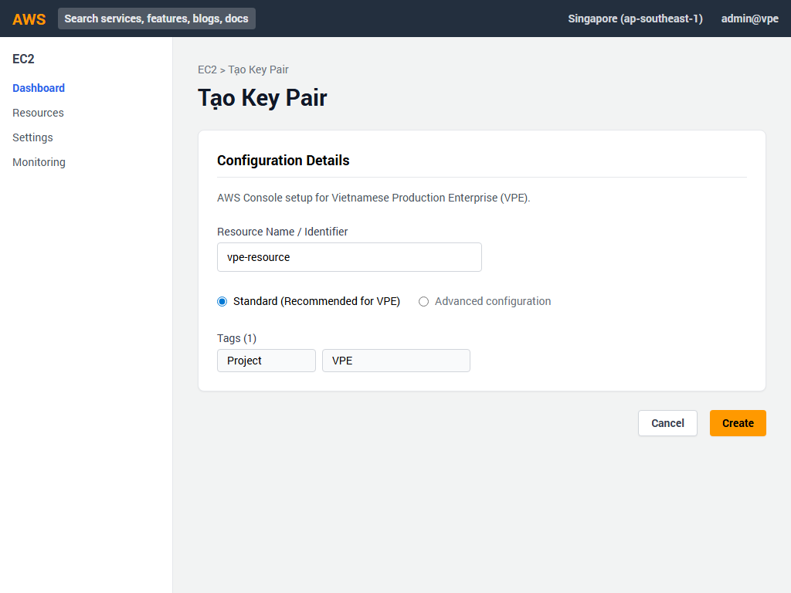
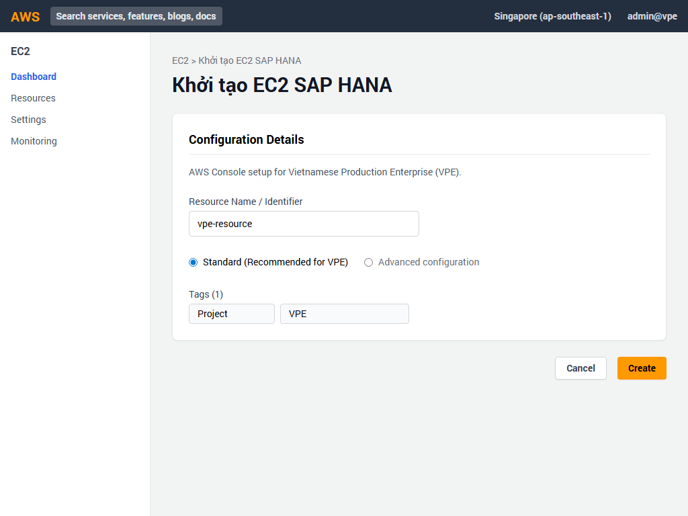
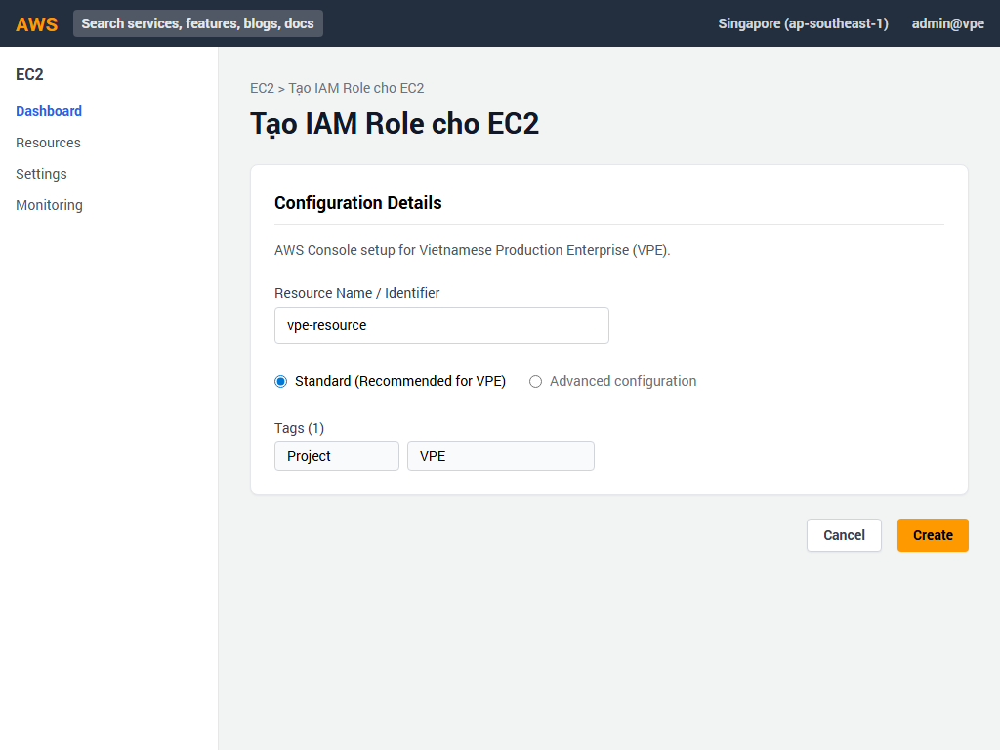
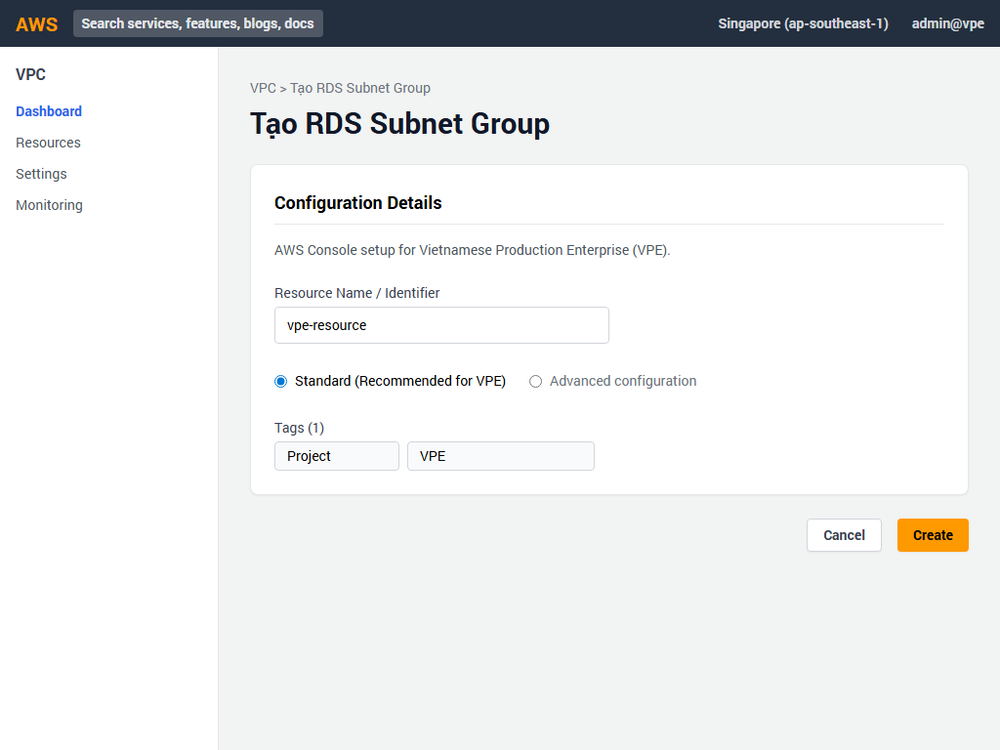
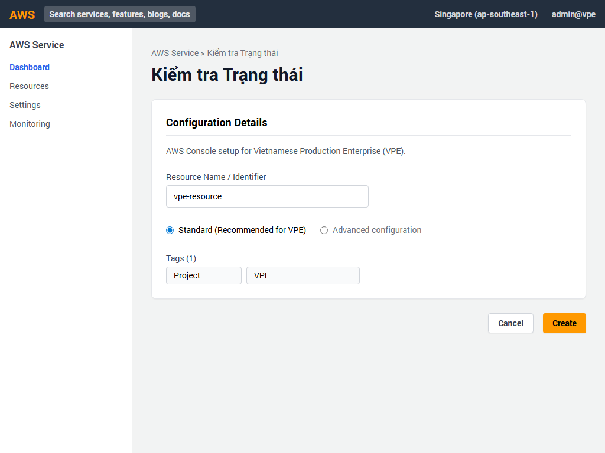

# Hướng dẫn Triển khai AWS Console - Phần 2: CORE ENTERPRISE (SAP HANA & FINANCE)

Dự án: **Vietnamese Production Enterprise (VPE)** 🏢

Tài liệu này cung cấp các bước chi tiết để triển khai hệ thống lõi doanh nghiệp qua giao diện AWS Management Console.

---

## 1. 🔑 Tạo Key Pair cho EC2
* Truy cập dịch vụ **EC2** trên AWS Console.
* Ở menu bên trái, chọn **Key Pairs** nằm dưới mục **Network & Security**.
* Nhấp vào nút màu cam **Create key pair** ở góc trên bên phải.
* Điền và chọn các thông tin sau:
  * **Name**: `vpe-prod-key`
  * **Key pair type**: `RSA`
  * **Private key file format**: `.pem`
* Nhấp nút **Create key pair** ở cuối trang.

* 💾 File `.pem` sẽ tự động tải xuống. Hãy lưu trữ an toàn để truy cập máy chủ sau này.

## 2. 🚀 Khởi tạo EC2 Instance cho SAP HANA
* Trong giao diện **EC2**, chọn **Instances** từ menu trái và nhấp **Launch instances**.
* Nhập các thông số chi tiết như sau:
  * **Name and tags**: `vpe-sap-hana-prod`
  * **Application and OS Images (Amazon Machine Image)**: Tìm và chọn `SUSE Linux Enterprise Server for SAP Applications`.
  * **Instance type**: Chọn `r6i.16xlarge` (64 vCPU, 512 GiB).
  * **Key pair (login)**: Chọn `vpe-prod-key` đã tạo ở bước 1.
* Mở rộng phần **Network settings**, nhấp **Edit** và cấu hình:
  * **VPC**: `vpe-prod-core-vpc`
  * **Subnet**: `vpe-core-app-subnet-1a`
  * **Auto-assign public IP**: `Disable`
  * **Firewall (security groups)**: Chọn `Select existing security group` và chọn `vpe-sap-sg`.
* Mở rộng phần **Configure storage**:
  * Root volume: `50 GiB`, chọn loại ổ đĩa `gp3`.
  * Nhấp **Add new volume**: `1000 GiB`, chọn loại ổ đĩa `io2` (Dành riêng cho lưu trữ SAP Data).
* Kiểm tra lại bảng Tóm tắt (Summary) bên phải và nhấp nút **Launch instance** màu cam.

* Đợi đến khi thông báo thành công hiện ra và nhấp vào ID của instance để xem chi tiết.

## 3. 🛡️ Tạo IAM Instance Profile cho EC2
* Truy cập dịch vụ **IAM**.
* Ở menu bên trái, chọn **Roles** và nhấp nút **Create role**.
* Ở bước chọn loại thực thể tin cậy (**Trusted entity type**): Chọn `AWS service`.
* **Use case**: Chọn `EC2` và nhấp **Next**.
* Ở bước **Add permissions**: Nhập tìm kiếm và đánh dấu chọn chính sách `AmazonSSMManagedInstanceCore` để cho phép kết nối qua Session Manager.
* Nhấp **Next**, đặt tên cho Role (ví dụ: `vpe-ec2-ssm-role`) và nhấp **Create role**.

* Sau đó, quay lại màn hình EC2, tích chọn instance `vpe-sap-hana-prod`, chọn **Actions** > **Security** > **Modify IAM role** và gắn Role bạn vừa tạo.

## 4. 🌐 Tạo RDS Subnet Group
* Truy cập dịch vụ **RDS**.
* Ở menu bên trái, chọn **Subnet groups** và nhấp nút **Create DB subnet group**.
* Nhập các thông tin sau:
  * **Name**: `vpe-core-db-subnet-group`
  * **Description**: Subnet group cho hệ thống cơ sở dữ liệu Core.
  * **VPC**: Mở danh sách thả xuống và chọn `vpe-prod-core-vpc`.
* Ở phần **Add subnets**: Chọn các Availability Zones và chọn các subnet dành riêng cho Database (DB subnets) thuộc các vùng đó.
* Nhấp nút **Create** màu cam.

## 5. 🗄️ Tạo Cơ sở dữ liệu Oracle trên RDS
* Trong bảng điều khiển **RDS**, chọn **Databases** và nhấp **Create database**.
* **Database creation method**: Chọn `Standard create`.
* **Engine options**: Chọn `Oracle` và phiên bản `Oracle Enterprise Edition 19c`.
* **Templates**: Chọn `Production`.
* **Settings**:
  * **DB instance identifier**: `vpe-finance-oracle`
  * Nhập Master username và cấu hình mật khẩu an toàn.
* **Instance configuration**: Chọn `db.m5.2xlarge`.
* **Storage**:
  * **Storage type**: Chọn `Provisioned IOPS SSD (io1)`.
  * **Allocated storage**: `500 GiB`.
  * **Provisioned IOPS**: `3000`.
* **Connectivity**:
  * **Virtual private cloud (VPC)**: `vpe-prod-core-vpc`.
  * **DB Subnet group**: Chọn `vpe-core-db-subnet-group` vừa tạo.
  * **Public access**: Chọn `No`.
  * **VPC security group (firewall)**: Chọn `Choose existing` > tìm và chọn `vpe-db-sg`.
* Mở rộng phần **Additional configuration**:
  * **Backup retention period**: Chỉnh thành `7 days`.
* Cuộn xuống cuối và nhấp **Create database**.

* Lưu ý: Quá trình khởi tạo cơ sở dữ liệu có thể mất từ 15 đến 30 phút.

## 6. ✅ Kiểm tra Trạng thái Triển khai
* Truy cập **EC2** > **Instances**: Đảm bảo máy chủ `vpe-sap-hana-prod` hiển thị **Instance state** là `Running` màu xanh lá và **Status check** báo `2/2 checks passed`.
* Truy cập **RDS** > **Databases**: Đảm bảo cơ sở dữ liệu `vpe-finance-oracle` có trạng thái **Available**.

🎉 **Hoàn tất triển khai Phần 2: CORE ENTERPRISE cho dự án VPE!**
