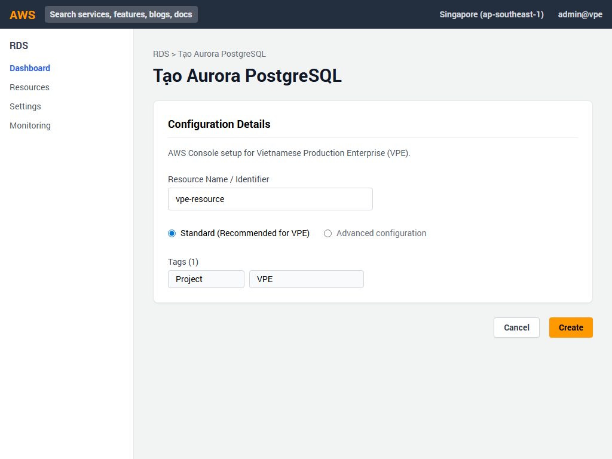
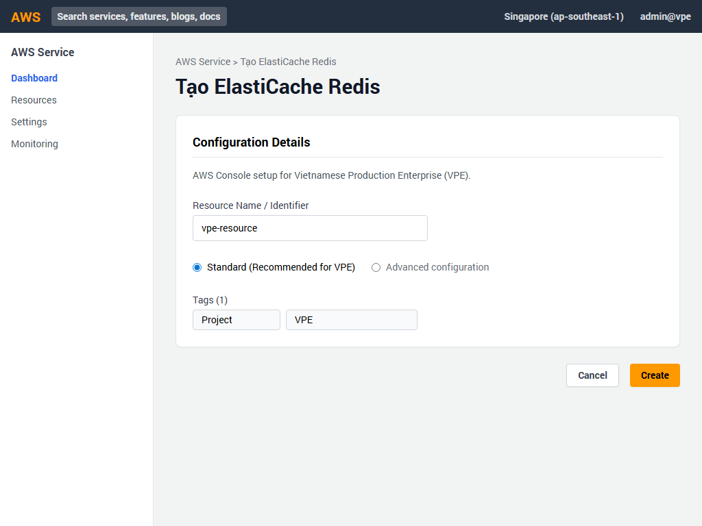
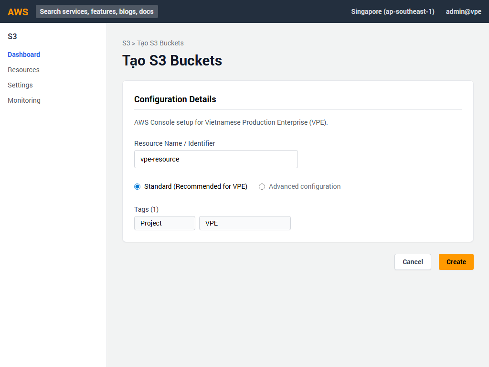
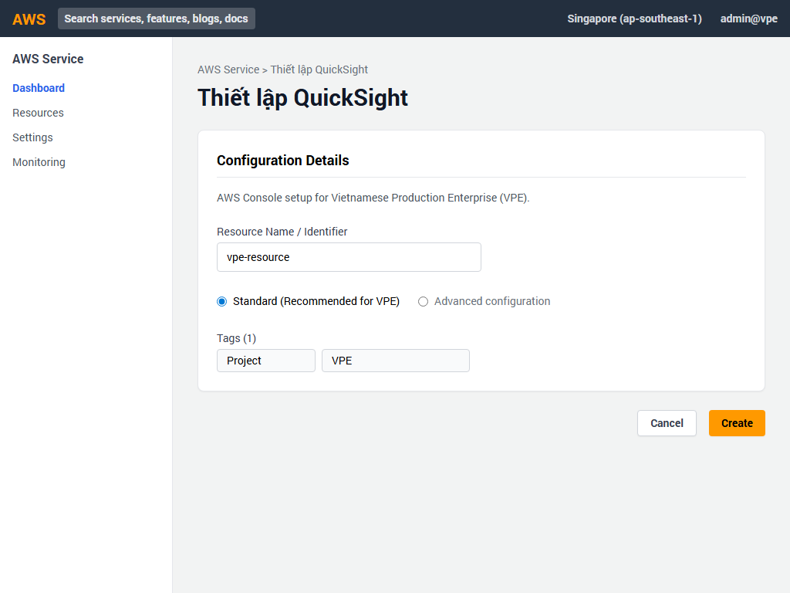

# Hướng Dẫn Cấu Hình Cổng Thông Tin AWS - PHẦN 3: CƠ SỞ DỮ LIỆU & DATA LAKE (Dự án VPE)

Tài liệu này cung cấp hướng dẫn từng bước (kèm hình ảnh minh họa) để triển khai các dịch vụ Cơ sở dữ liệu và Data Lake cho dự án Vietnamese Production Enterprise (VPE) thông qua AWS Management Console.

---

## 1. Tạo Bảng DynamoDB cho Ví Điện Tử (E-Wallet) 🏦

**Mục đích:** Lưu trữ lịch sử giao dịch ví điện tử với khả năng mở rộng linh hoạt.

**Các bước thực hiện:**
1. Mở AWS Console, tìm kiếm **DynamoDB** và chọn **Tables** ở menu bên trái.
2. Nhấn nút **Create table** màu cam.
3. Trong phần **Table details**:
   - **Table name**: Nhập `vpe-ewallet-transactions`
   - **Partition key**: Nhập `TransactionId` và chọn kiểu **String**.
   - **Sort key**: Nhập `Timestamp` và chọn kiểu **Number**.
4. Trong phần **Table settings**:
   - Chọn **Customize settings**.
   - Tại mục **Capacity calculator/Read/write capacity mode**, chọn **On-demand**.
5. Kéo xuống phần **Global secondary indexes**:
   - Nhấn **Create index**.
   - **Partition key**: Nhập `UserId` (String).
   - **Sort key**: Nhập `Timestamp` (Number).
   - Tên index sẽ tự động là `UserId-Index`.
6. Giữ các cấu hình còn lại mặc định và nhấn nút **Create table** ở cuối trang.

---

## 2. Tạo Cluster Aurora PostgreSQL cho CRM 📊

**Mục đích:** Cơ sở dữ liệu quan hệ chính cho hệ thống Quản lý Khách hàng (Sales CRM).

**Các bước thực hiện:**
1. Truy cập dịch vụ **RDS** trên AWS Console.
2. Tại menu bên trái, chọn **Databases** và nhấn **Create database**.
3. **Database creation method**: Chọn **Standard create**.
4. **Engine options**:
   - Chọn **Amazon Aurora**.
   - Tại **Edition**, chọn **Amazon Aurora PostgreSQL-Compatible Edition**.
5. **Templates**: Chọn **Production**.
6. **Settings**:
   - **DB cluster identifier**: Nhập `vpe-sales-crm-aurora`
   - **Master username**: Nhập `crmadmin`
   - Cài đặt mật khẩu bảo mật (tự nhập hoặc chọn Auto generate).
7. **Instance configuration**:
   - Chọn **Memory Optimized classes**.
   - Chọn **db.r6g.large**.
8. **Availability & durability**:
   - Tại mục Multi-AZ deployment, chọn **Create Aurora Replica or Reader node in a different AZ** để đảm bảo tính sẵn sàng cao.
9. **Connectivity**:
   - **Virtual private cloud (VPC)**: Chọn VPC của ứng dụng (VD: `vpe-prod-sales-vpc`).
10. Nhấn **Create database**.

---

## 3. Tạo ElastiCache Redis cho Online Shop 🛒

**Mục đích:** Lưu trữ bộ đệm (cache) giúp tăng tốc độ phản hồi cho cửa hàng trực tuyến.

**Các bước thực hiện:**
1. Tìm và mở dịch vụ **ElastiCache**.
2. Chọn **Redis clusters** và nhấn **Create Redis cluster**.
3. **Cluster mode**: Chọn **Disabled** (vì chỉ cần 1 node chính).
4. **Cluster info**:
   - **Name**: Nhập `vpe-shop-redis`.
5. **Cluster settings**:
   - **Engine version**: Chọn **7.0**.
   - **Node type**: Tìm và chọn **cache.t4g.medium**.
   - **Number of replicas**: Nhập **1** (1 primary, 1 replica).
6. **Connectivity**:
   - **Subnet group**: Chọn subnet group thuộc VPC `vpe-prod-sales-vpc`.
7. Nhấn **Create**.

---

## 4. Tạo Các S3 Buckets cho Data Lake 🪣

**Mục đích:** Xây dựng hồ dữ liệu (Data Lake) với 3 vùng lưu trữ riêng biệt.

**Các bước thực hiện:**
1. Truy cập dịch vụ **S3** và nhấn **Create bucket**.

**Bucket 1: Dữ liệu thô (Raw Data)**
- **Bucket name**: `vpe-datalake-raw-data`
- **Block Public Access**: Đảm bảo tích chọn **Block all public access**.
- **Bucket Versioning**: Chọn **Enable** (quan trọng để tránh mất dữ liệu).
- Nhấn **Create bucket**.

**Bucket 2 & 3: Dữ liệu xử lý & Athena**
Lặp lại quy trình trên cho 2 bucket còn lại (không bắt buộc bật versioning nếu không cần):
- `vpe-datalake-processed`
- `vpe-athena-results`

---

## 5. Tạo AWS Glue Database & Crawler 🕷️

**Mục đích:** Tự động khám phá schema dữ liệu từ S3 và lưu vào Data Catalog.

**Các bước thực hiện:**
1. Mở console **AWS Glue**.
2. Ở menu trái, dưới phần Data Catalog, chọn **Databases** > **Add database**.
   - Nhập tên: `vpe_analytics_db` và lưu lại.
3. Chuyển sang phần **Crawlers** và nhấn **Create crawler**.
4. **Crawler details**: Tên là `vpe-farm-data-crawler`.
5. **Choose data sources**:
   - Nhấn **Add a data source**.
   - Data source: **S3**.
   - S3 path: `s3://vpe-datalake-processed/farm-telemetry/`.
6. **Configure security**:
   - Chọn IAM Role: `vpe-glue-service-role` (tạo sẵn có quyền đọc S3).
7. **Set output and scheduling**:
   - Target database: Chọn `vpe_analytics_db` vừa tạo.
   - Schedule: Chọn **On demand**.
8. Xem lại thông tin và nhấn **Create crawler**. (Sau đó bạn có thể nhấn Run crawler).

---

## 6. Cấu hình Amazon Athena 🔍

**Mục đích:** Truy vấn trực tiếp dữ liệu từ Data Lake bằng SQL.

**Các bước thực hiện:**
1. Mở console **Athena**. Lần đầu tiên truy cập, bạn cần thiết lập thư mục lưu kết quả.
2. Chọn **Query editor**. Nhấn vào nút **Settings** hoặc **Edit settings** hiện lên trên cảnh báo.
3. **Query result location**: Nhập `s3://vpe-athena-results/output/`.
4. Nếu sử dụng Workgroup riêng:
   - Chuyển sang tab **Workgroups**, chọn `vpe-analytics-wg` (hoặc tạo mới).
5. Quay lại **Query editor**:
   - Ở cột Data bên trái, mục **Database**, chọn `vpe_analytics_db`.
   - Giờ đây bạn có thể thấy các bảng được Crawler quét và thực thi các câu lệnh SELECT.

---

## 7. Thiết lập Amazon QuickSight 📈

**Mục đích:** Trực quan hóa dữ liệu kinh doanh và phân tích (BI Dashboard).

**Các bước thực hiện:**
1. Mở **QuickSight** từ AWS Console (nếu chưa đăng ký, chọn Sign up for QuickSight và chọn gói Enterprise).
2. Khi đã ở giao diện QuickSight, nhấn **New dataset** (Tập dữ liệu mới).
3. Chọn nguồn dữ liệu là **Athena**.
4. **Data source name**: Nhập `VPE-Athena-Source` và nhấn Create data source.
5. Ở cửa sổ tiếp theo:
   - Database: Chọn `vpe_analytics_db`.
   - Chọn bảng muốn phân tích (ví dụ bảng `farm_telemetry`).
6. Bạn có thể chọn **Import to SPICE for quicker analytics** (Lưu vào bộ đệm SPICE) để tối ưu tốc độ báo cáo.
7. Nhấn **Visualize** để bắt đầu kéo thả tạo biểu đồ.

