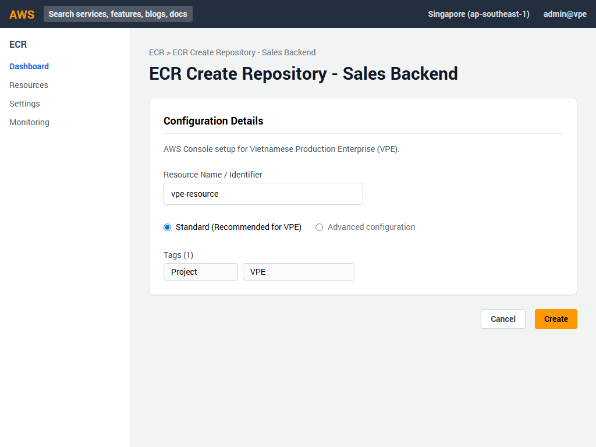
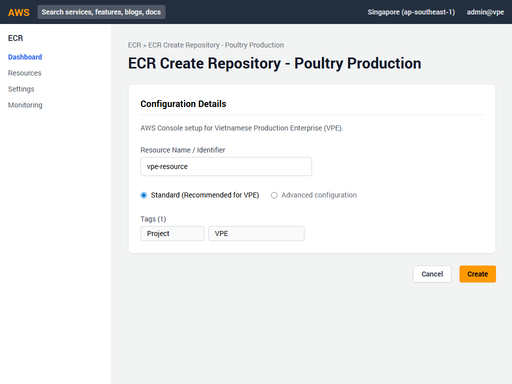
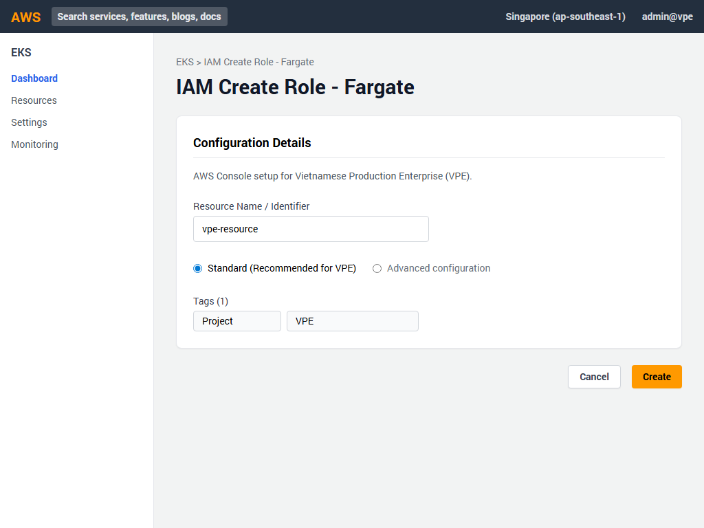
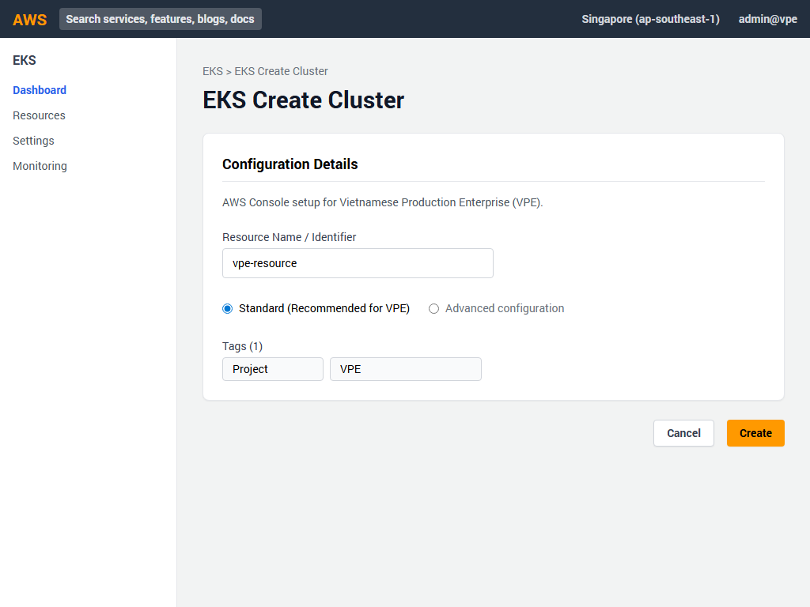
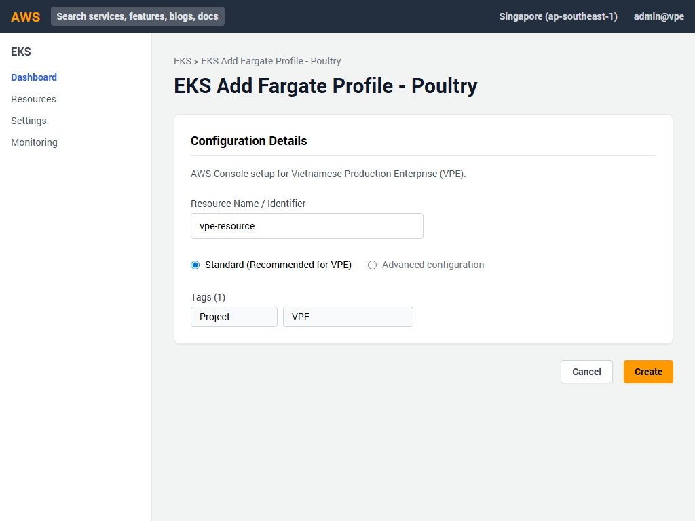
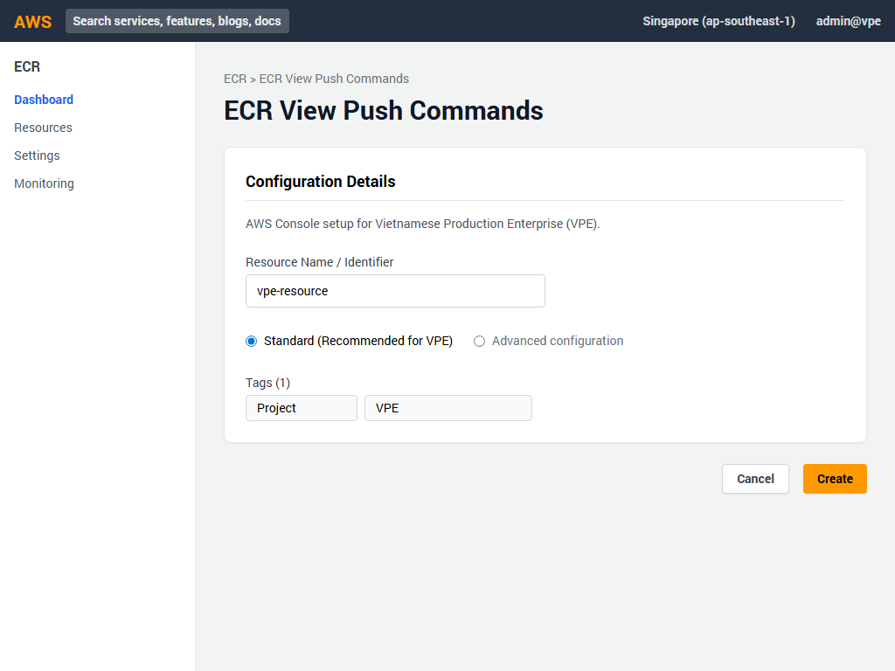

# Hướng dẫn Triển khai AWS Console - Phần 4: Containers & Microservices (EKS, ECR)

Tài liệu này cung cấp hướng dẫn chi tiết từng bước trên giao diện AWS Management Console để triển khai các dịch vụ container cho dự án Vietnamese Production Enterprise (VPE).

## 1. Tạo ECR Repository cho Sales Backend

1. Đăng nhập vào AWS Management Console, tìm kiếm **ECR** và chọn **Elastic Container Registry**.
2. Nhấn nút **Create repository** màu cam.
3. Trong phần General settings:
   - **Visibility settings**: Chọn **Private**.
   - **Repository name**: Nhập `vpe/sales-app-backend`.
   - **Tag mutability**: Chọn **Mutable**.
4. Kéo xuống phần **Image scan settings**:
   - Bật **Scan on push** (Enabled).
5. Nhấn nút **Create repository** ở dưới cùng.

## 2. Tạo ECR Repository cho SOP Platform

1. Lặp lại các bước tương tự như trên.
2. Trên trang **Create repository**:
   - **Visibility settings**: Chọn **Private**.
   - **Repository name**: Nhập `vpe/sop-platform`.
   - **Tag mutability**: Chọn **Mutable**.
   - **Scan on push**: Bật (Enabled).
3. Nhấn **Create repository**.

## 3. Tạo ECR Repository cho Poultry Production

1. Tương tự, trên trang **Create repository**:
   - **Visibility settings**: Chọn **Private**.
   - **Repository name**: Nhập `vpe/poultry-production-api`.
   - **Tag mutability**: Chọn **Mutable**.
   - **Scan on push**: Bật (Enabled).
3. Nhấn **Create repository**.

## 4. Tạo IAM Role cho EKS Cluster

1. Chuyển sang dịch vụ **IAM** từ thanh tìm kiếm.
2. Chọn **Roles** ở menu bên trái, sau đó nhấn **Create role**.
3. Trong bước Select trusted entity:
   - **Trusted entity type**: Chọn **AWS service**.
   - **Use case**: Tìm và chọn **EKS - Cluster**.
   - Nhấn **Next**.
4. Trong bước Add permissions, chính sách `AmazonEKSClusterPolicy` đã được tự động chọn. Nhấn **Next**.
5. Trong bước Name, review, and create:
   - **Role name**: Nhập `vpe-eks-cluster-role`.
6. Nhấn **Create role**.

## 5. Tạo IAM Role cho Fargate

1. Trên trang IAM Roles, nhấn **Create role** một lần nữa.
2. Trong bước Select trusted entity:
   - **Trusted entity type**: Chọn **AWS service**.
   - **Use case**: Tìm và chọn **EKS - Fargate pod**.
   - Nhấn **Next**.
3. Trong bước Add permissions, chính sách `AmazonEKSFargatePodExecutionRolePolicy` đã được tự động chọn. Nhấn **Next**.
4. Trong bước Name, review, and create:
   - **Role name**: Nhập `vpe-fargate-execution-role`.
5. Nhấn **Create role**.

## 6. Tạo EKS Cluster

1. Tìm kiếm và mở dịch vụ **EKS** (Elastic Kubernetes Service).
2. Nhấn **Add cluster** và chọn **Create**.
3. Bước 1 - Configure cluster:
   - **Name**: Nhập `vpe-prod-eks-cluster`.
   - **Kubernetes version**: Chọn **1.28**.
   - **Cluster service role**: Chọn `vpe-eks-cluster-role`.
   - Nhấn **Next**.
4. Bước 2 - Specify networking:
   - **VPC**: Chọn `vpe-prod-core-vpc`.
   - **Subnets**: Đảm bảo chỉ chọn các private subnets (bỏ chọn các public subnets).
   - **Cluster endpoint access**: Chọn **Private**.
   - Nhấn **Next**.
5. Tiếp tục nhấn **Next** qua các bước còn lại và cuối cùng nhấn **Create**. (Lưu ý: Quá trình tạo cluster có thể mất 10-15 phút).

## 7. Tạo Fargate Profile cho SOP

1. Sau khi Cluster trạng thái chuyển sang `Active`, nhấp vào tên cluster `vpe-prod-eks-cluster`.
2. Chuyển sang tab **Compute**.
3. Kéo xuống phần **Fargate profiles** và nhấn **Add Fargate profile**.
4. Cấu hình profile:
   - **Name**: Nhập `vpe-sop-workloads`.
   - **Pod execution role**: Chọn `vpe-fargate-execution-role`.
   - **Subnets**: Đảm bảo các private subnets được chọn.
   - Nhấn **Next**.
5. Pod selectors:
   - **Namespace**: Nhập `vpe-sop`.
6. Nhấn **Next** sau đó nhấn **Create**.

## 8. Tạo Fargate Profile cho Sales

1. Quay lại tab **Compute** của cluster, nhấn **Add Fargate profile**.
2. Cấu hình profile:
   - **Name**: Nhập `vpe-sales-workloads`.
   - **Pod execution role**: Chọn `vpe-fargate-execution-role`.
   - **Subnets**: Đảm bảo các private subnets được chọn.
   - Nhấn **Next**.
3. Pod selectors:
   - **Namespace**: Nhập `vpe-sales`.
4. Nhấn **Next** sau đó nhấn **Create**.

## 9. Tạo Fargate Profile cho Poultry

1. Quay lại tab **Compute** của cluster, nhấn **Add Fargate profile**.
2. Cấu hình profile:
   - **Name**: Nhập `vpe-poultry-workloads`.
   - **Pod execution role**: Chọn `vpe-fargate-execution-role`.
   - **Subnets**: Đảm bảo các private subnets được chọn.
   - Nhấn **Next**.
3. Pod selectors:
   - **Namespace**: Nhập `vpe-poultry`.
4. Nhấn **Next** sau đó nhấn **Create**.

## 10. Đẩy (Push) Docker Image lên ECR

1. Mở lại dịch vụ **ECR** và nhấp vào repository `vpe/sales-app-backend` (hoặc các repository khác).
2. Nhấn nút **View push commands** ở góc trên bên phải.
3. Một hộp thoại sẽ hiện ra hiển thị 4 bước lệnh cho macOS/Linux hoặc Windows:
   - Lấy token xác thực Docker login.
   - Xây dựng (build) Docker image.
   - Gắn thẻ (tag) cho image.
   - Đẩy (push) image lên repository.
4. Sao chép và chạy lần lượt các lệnh này trong Terminal/Command Prompt trên máy tính có chứa mã nguồn dự án.

