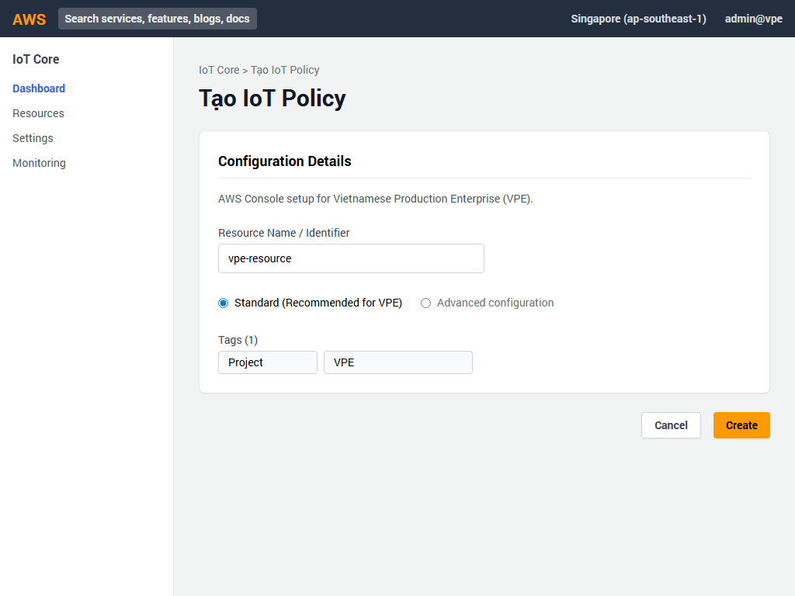
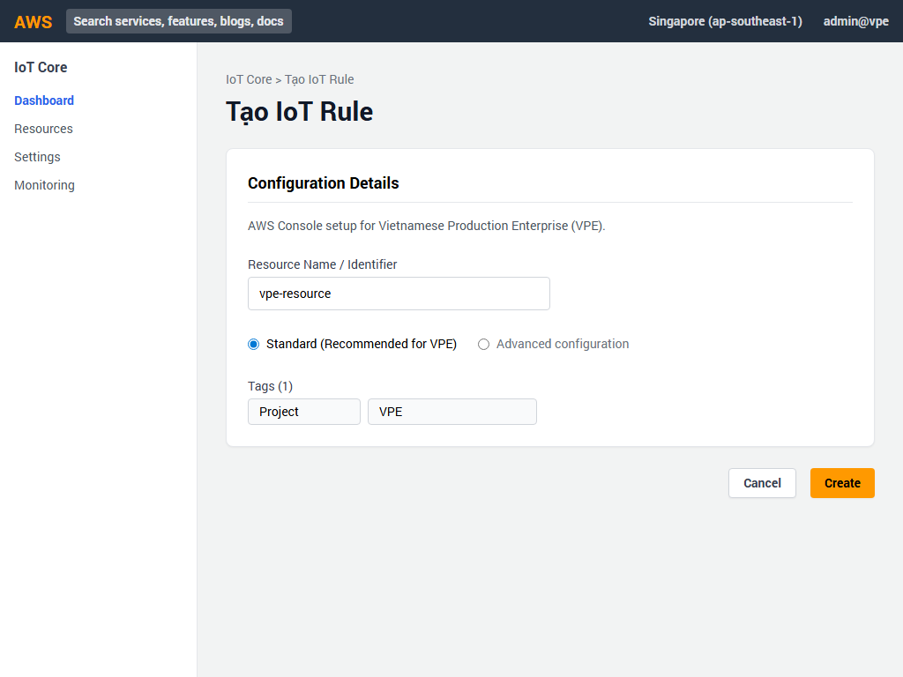
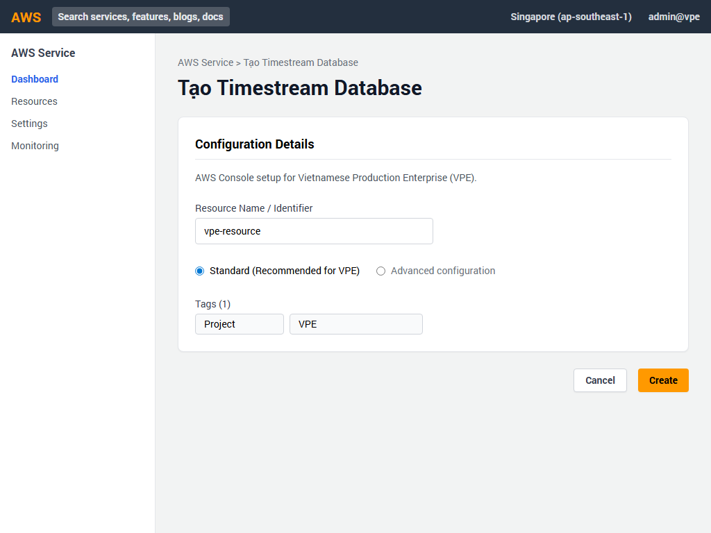
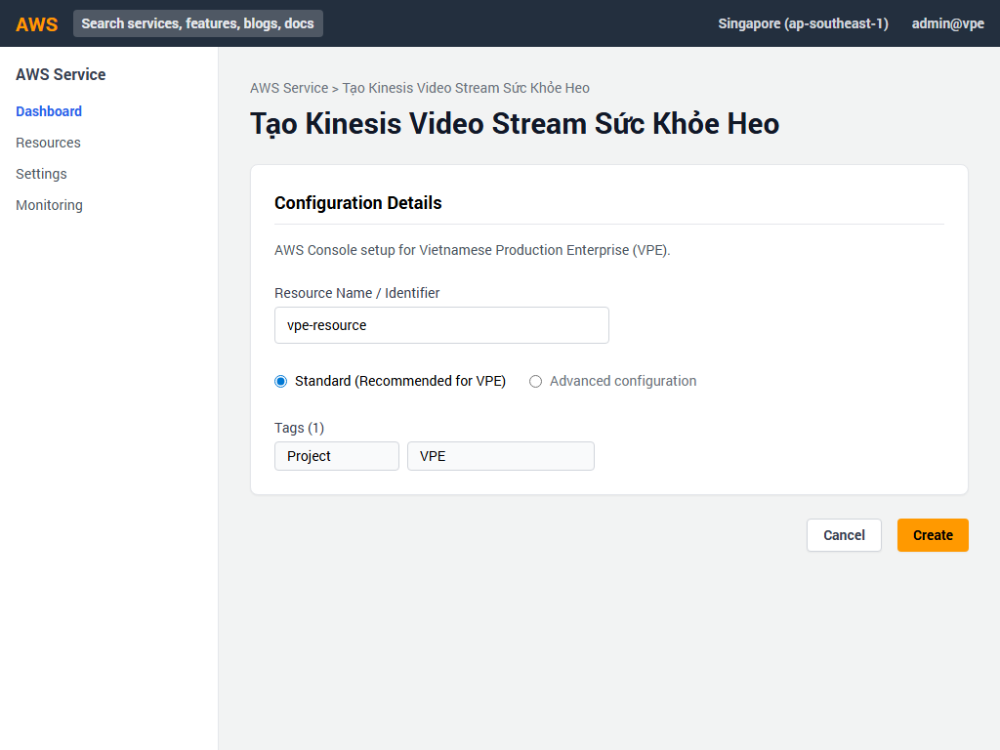
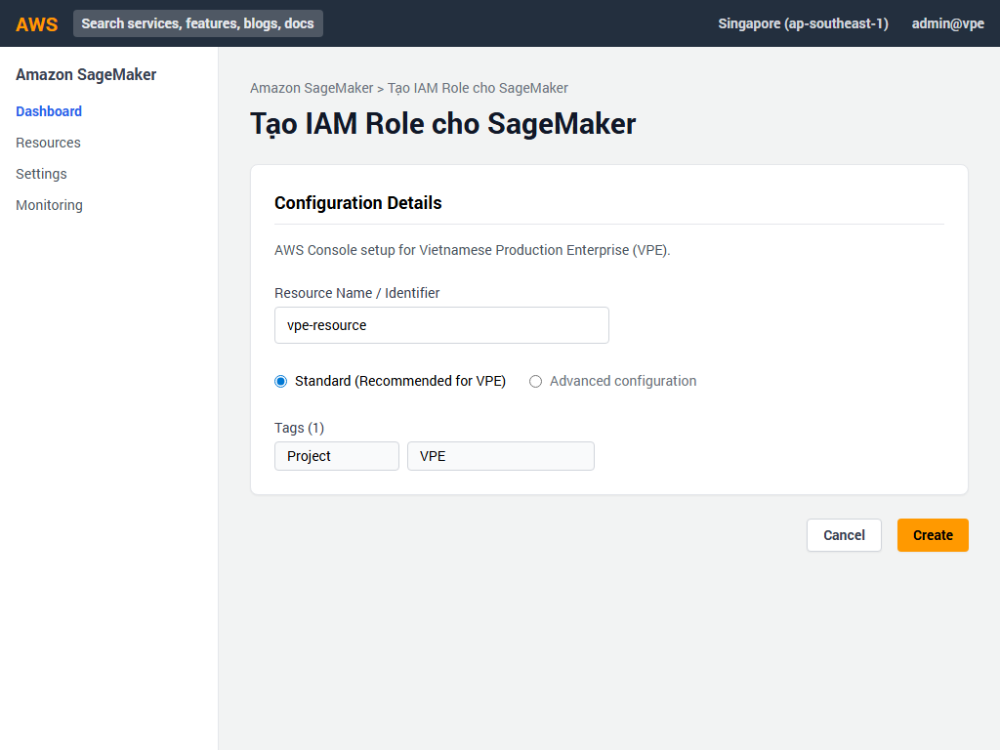
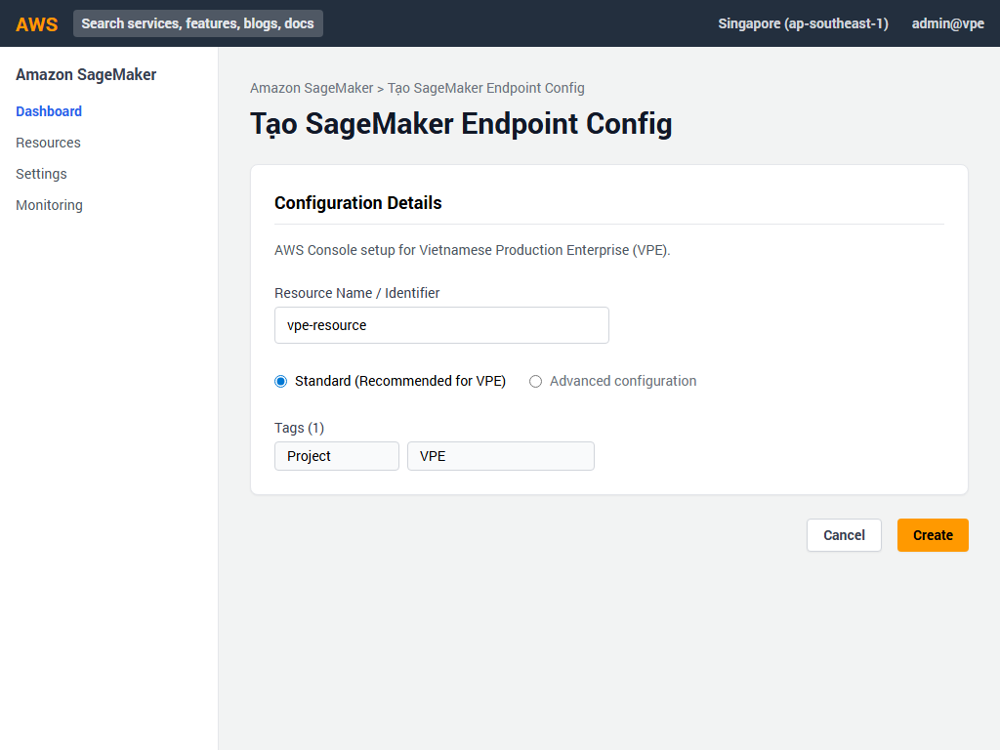
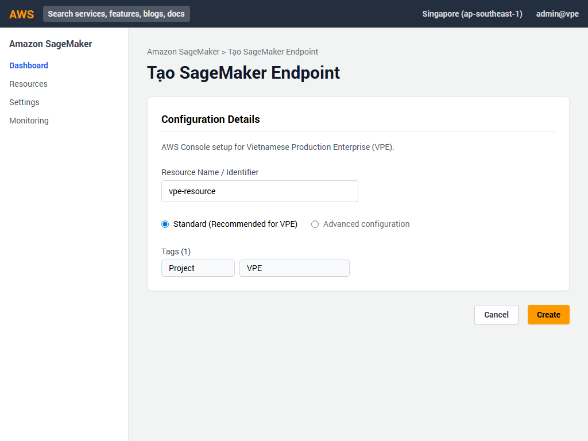

# 📘 Hướng Dẫn Triển Khai GUI - Phần 5: IoT & Học Máy (Machine Learning)
Dự án: **Vietnamese Production Enterprise (VPE)**

Tài liệu này cung cấp hướng dẫn chi tiết từng bước để triển khai các dịch vụ IoT và Học máy cho VPE thông qua giao diện AWS Management Console.

---

## 🚀 1. Tạo IoT Policy

Bước đầu tiên là tạo một chính sách (Policy) trong AWS IoT Core để cấp quyền cho các thiết bị cảm biến nông trại.

1. Truy cập vào **AWS IoT Core** trong AWS Console.
2. Từ menu điều hướng bên trái, chọn **Security** > **Policies**.
3. Nhấn nút màu cam **Create policy**.
4. Điền các thông tin sau:
   - **Name**: `vpe-farm-sensor-policy`
   - **Policy document**:
     - **Action**: `iot:*`
     - **Resource ARN**: `*`
     - **Effect**: Chọn **Allow**
5. Nhấn nút **Create** để hoàn tất.

---

## 🐷 2. Tạo IoT Thing (Thiết bị theo dõi heo)

Tiếp theo, chúng ta sẽ đăng ký một thiết bị (Thing) đại diện cho cảm biến theo dõi đàn heo.

1. Trong **AWS IoT Core**, chọn **Manage** > **Things**.
2. Nhấn nút **Create things**.
3. Chọn **Create single thing** và nhấn **Next**.
4. Trong phần **Thing properties**:
   - **Thing name**: `vpe-swine-monitor-001`
   - Nhấn **Next**.
5. Trong phần **Device Certificate**:
   - Chọn **Auto-generate a new certificate** (Tự động tạo chứng chỉ mới) và nhấn **Next**.
6. Trong phần **Policies**:
   - Chọn chính sách vừa tạo: `vpe-farm-sensor-policy`.
7. Nhấn **Create thing**.
8. ⚠️ **LƯU Ý QUAN TRỌNG**: Một hộp thoại tải xuống chứng chỉ sẽ hiện ra. Hãy tải xuống tất cả các tệp chứng chỉ (Device certificate, Public/Private key, Root CA) vì bạn sẽ không thể tải lại chúng sau này!

---

## 🔀 3. Tạo IoT Rule (Định tuyến dữ liệu sang Timestream)

Để lưu trữ dữ liệu từ cảm biến vào cơ sở dữ liệu chuỗi thời gian, ta cần tạo một Rule.

1. Trong **AWS IoT Core**, chọn **Message routing** > **Rules**.
2. Nhấn **Create rule**.
3. **Name**: `vpe_farm_telemetry_rule` và nhấn **Next**.
4. **SQL statement**: Nhập `SELECT * FROM 'vpe/farms/+/telemetry'` và nhấn **Next**.
5. Trong phần **Rule actions**:
   - Chọn **Action 1**: **Timestream table**.
   - **Database name**: Nhập `vpe-farm-telemetry-db`.
   - **Table name**: Nhập `SensorData`.
   - Cấu hình **Dimensions**: thêm `FarmId` và `DeviceType`.
6. Chọn IAM role phù hợp và nhấn **Create**.

---

## 📈 4. Tạo Amazon Timestream Database

Thiết lập cơ sở dữ liệu để lưu trữ dữ liệu đo lường liên tục từ các thiết bị IoT.

1. Truy cập dịch vụ **Amazon Timestream**.
2. Chọn **Databases** và nhấn **Create database**.
3. Chọn **Standard database**.
4. **Name**: `vpe-farm-telemetry-db`.
5. Nhấn **Create database**.
6. Chọn database vừa tạo, qua tab **Tables** và nhấn **Create table**.
7. **Table name**: `SensorData`.
8. Cấu hình thời gian lưu trữ (Data retention):
   - **Memory store retention**: `24 hours` (24 giờ)
   - **Magnetic store retention**: `365 days` (365 ngày)
9. Nhấn **Create table**.

---

## 🎥 5. Tạo Kinesis Video Stream (Camera Trại ấp)

Thiết lập luồng video để phân tích hình ảnh AI cho trại ấp.

1. Truy cập **Amazon Kinesis Video Streams**.
2. Chọn **Video streams** và nhấn **Create video stream**.
3. **Video stream name**: `vpe-hatchery-ai-stream`.
4. Cấu hình **Data retention**: `24 hours` (24 giờ).
5. Để các cài đặt khác ở mặc định.
6. Nhấn nút màu cam **Create video stream**.

---

## 🐖 6. Tạo Kinesis Video Stream (Sức khỏe heo)

Thiết lập luồng video thứ hai để giám sát sức khỏe của heo.

1. Vẫn trong **Amazon Kinesis Video Streams**, nhấn **Create video stream** lần nữa.
2. **Video stream name**: `vpe-swine-health-stream`.
3. Cấu hình **Data retention**: `48 hours` (48 giờ).
4. Nhấn **Create video stream**.

---

## 🔐 7. Tạo IAM Role cho SageMaker

Để SageMaker có quyền truy cập vào các tài nguyên cần thiết, chúng ta phải tạo một IAM Role.

1. Truy cập dịch vụ **IAM** (Identity and Access Management).
2. Chọn **Roles** > **Create role**.
3. **Trusted entity type**: Chọn **AWS service**.
4. **Use case**: Chọn **SageMaker** và nhấn **Next**.
5. Trong phần **Add permissions**, tìm và đánh dấu vào chính sách `AmazonSageMakerFullAccess`.
6. Nhấn **Next**.
7. **Role name**: `vpe-sagemaker-role`.
8. Nhấn **Create role**.

---

## 🧠 8. Tạo SageMaker Model

Thiết lập mô hình Học máy để phân tích sức khỏe vật nuôi.

1. Truy cập **Amazon SageMaker**.
2. Trong menu điều hướng bên trái, phần **Inference**, chọn **Models**.
3. Nhấn nút **Create model**.
4. **Model name**: `vpe-animal-health-model`.
5. **IAM role**: Chọn role vừa tạo `vpe-sagemaker-role`.
6. Trong phần **Container definition 1**:
   - Cung cấp **Container image** từ ECR.
   - Cung cấp **Model artifact S3 path** (đường dẫn S3 tới tệp cấu trúc mô hình của bạn).
7. Nhấn **Create model**.

---

## ⚙️ 9. Tạo SageMaker Endpoint Configuration

Định cấu hình tài nguyên phần cứng cho mô hình dự đoán.

1. Trong phần **Inference** của SageMaker, chọn **Endpoint configurations**.
2. Nhấn **Create endpoint configuration**.
3. **Endpoint configuration name**: `vpe-animal-health-endpoint-cfg`.
4. Trong phần **Production variants**, nhấn **Add model**.
5. Chọn mô hình `vpe-animal-health-model` vừa tạo và nhấn **Save**.
6. Cấu hình tài nguyên (Instance):
   - **Instance type**: `ml.c5.xlarge`
   - **Initial instance count**: `1`
7. Nhấn **Create endpoint configuration**.

---

## 🌐 10. Tạo SageMaker Endpoint

Cuối cùng, triển khai Endpoint để cung cấp API dự đoán theo thời gian thực.

1. Trong phần **Inference** của SageMaker, chọn **Endpoints**.
2. Nhấn **Create endpoint**.
3. **Endpoint name**: `vpe-animal-health-endpoint`.
4. Chọn **Use an existing endpoint configuration**.
5. Chọn `vpe-animal-health-endpoint-cfg` trong danh sách.
6. Nhấn **Create endpoint**.
7. ⏳ **Lưu ý**: Endpoint sẽ mất vài phút để khởi tạo. Trạng thái sẽ chuyển từ **Creating** (Đang tạo) sang **InService** (Sẵn sàng phục vụ).

