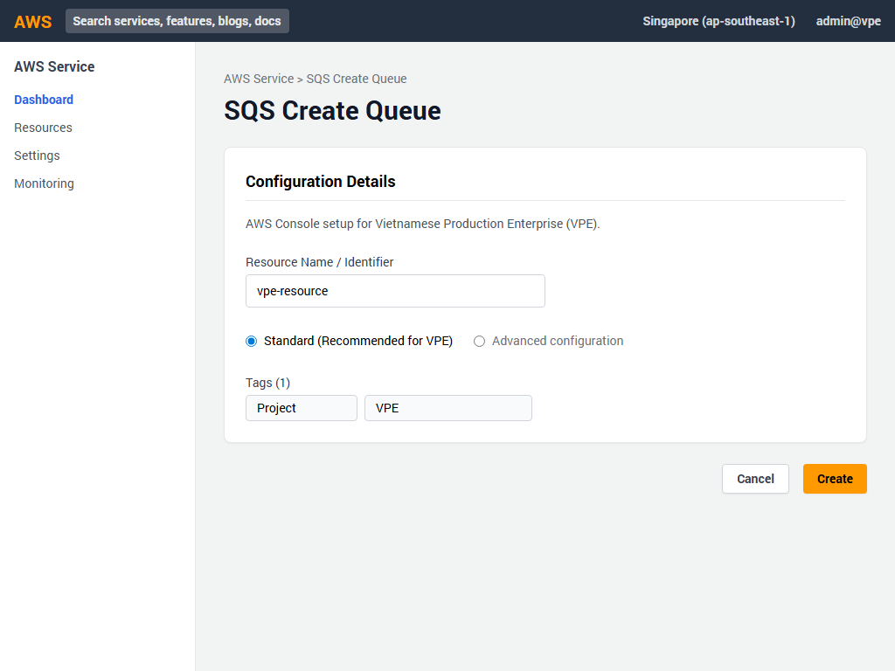
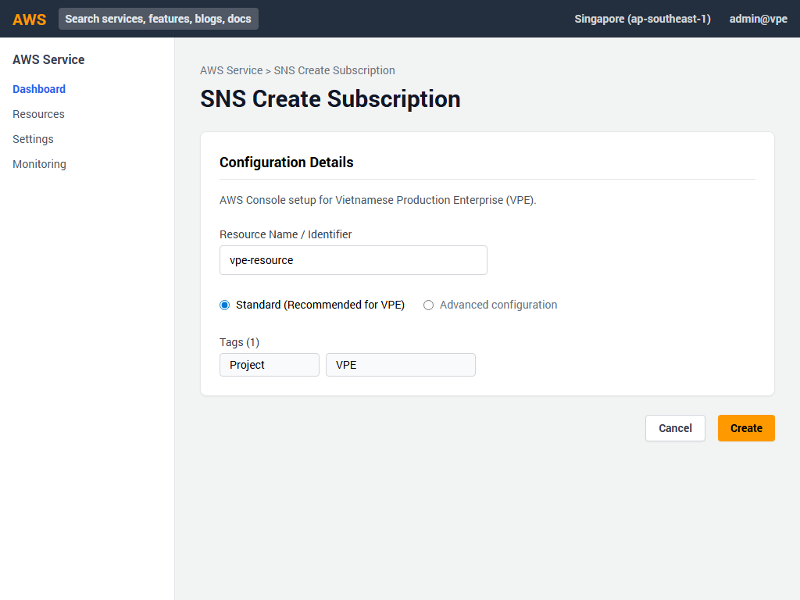
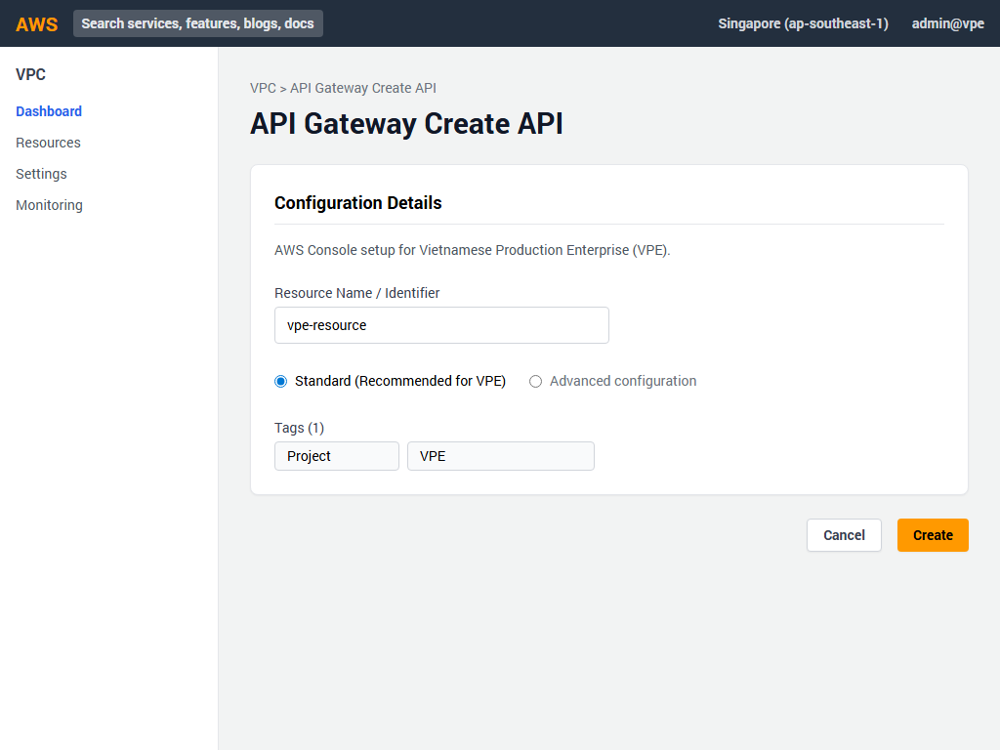
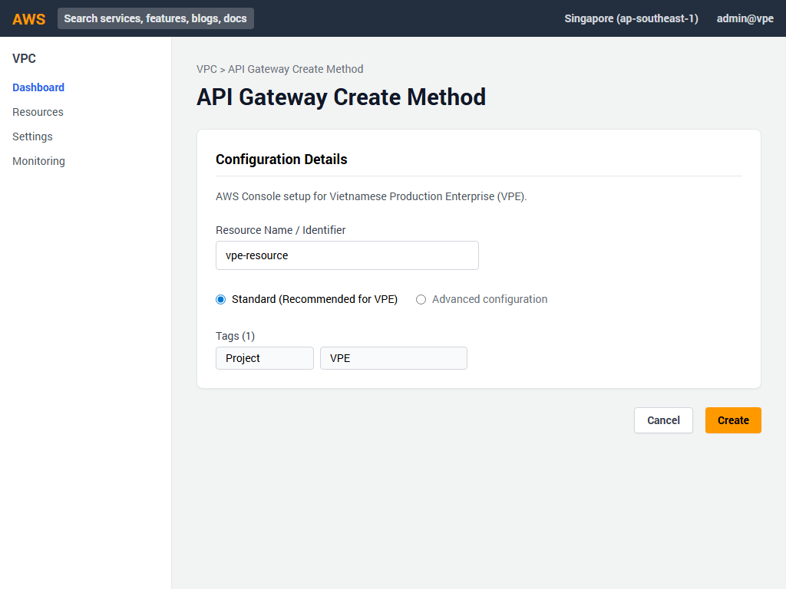
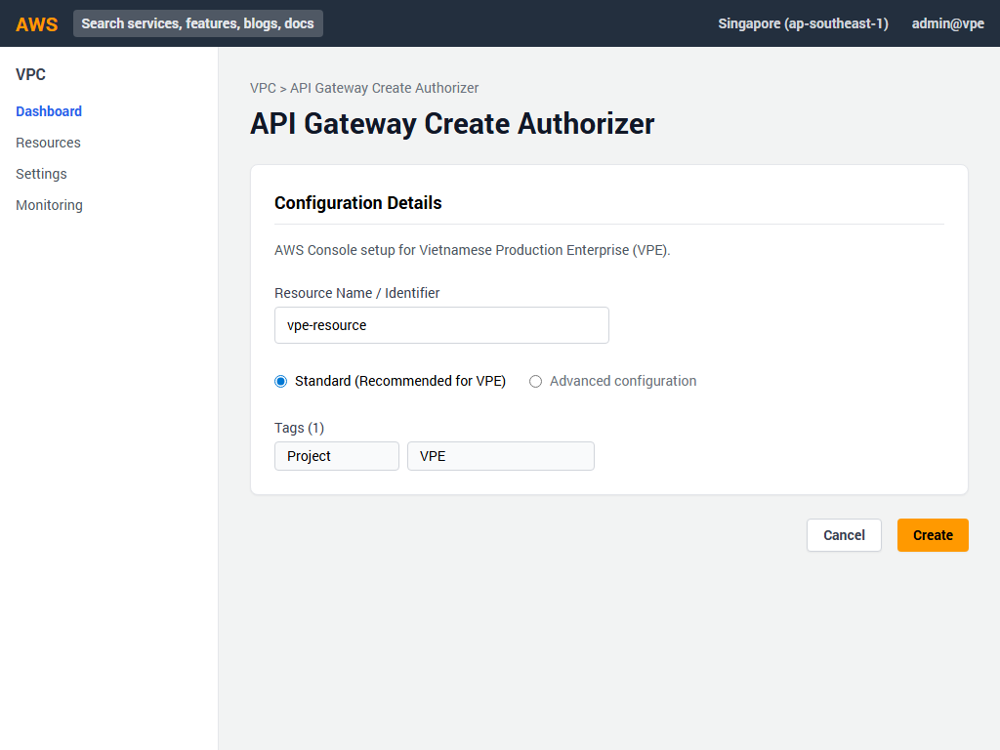
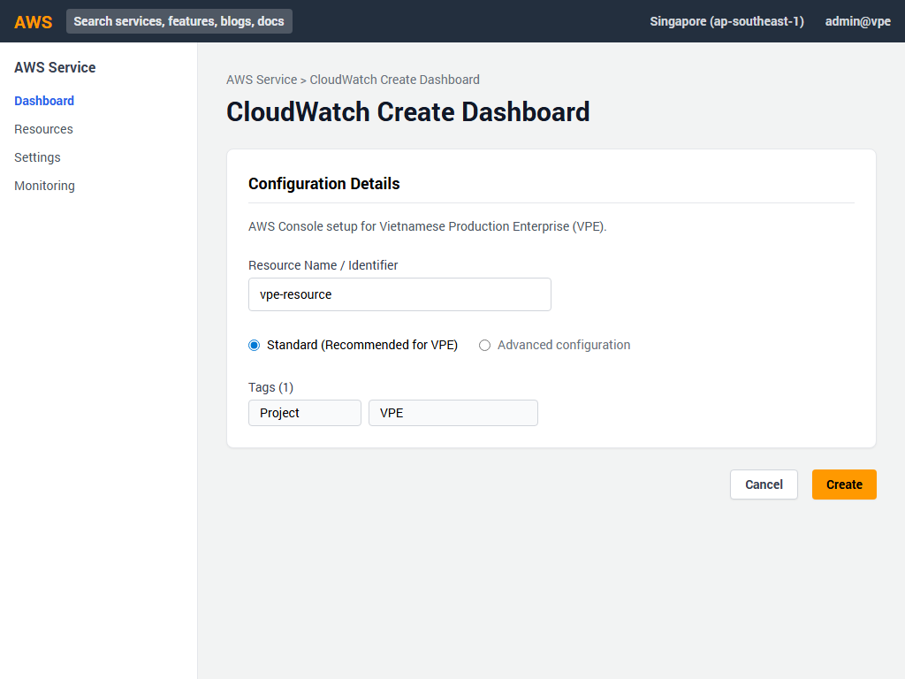

# Hướng dẫn Triển khai AWS Console - Phần 6: Serverless & Messaging

Tài liệu này cung cấp hướng dẫn từng bước chi tiết để cấu hình các dịch vụ Serverless và Messaging cho dự án **Vietnamese Production Enterprise (VPE)** qua giao diện AWS Management Console.

---

## 1. Khởi tạo SQS Queue

Amazon SQS được sử dụng để nhận và xử lý các đơn hàng một cách không đồng bộ.

**Các bước thực hiện:**
1. Truy cập vào AWS Console, tìm kiếm dịch vụ **SQS (Simple Queue Service)**.
2. Chọn **Create queue**.
3. Cấu hình các thông số sau:
   - **Type**: Chọn `Standard`
   - **Name**: Nhập `vpe-sales-orders-queue`
   - **Visibility timeout**: `30` Seconds
   - **Message retention period**: `4` Days
   - **Delivery delay**: `0` Seconds
   - **Maximum message size**: `256` KB
   - **Receive message wait time**: `10` Seconds
4. Nhấn nút **Create queue** ở cuối trang để hoàn tất.

---

## 2. Khởi tạo SNS Topic

Amazon SNS được dùng để gửi các cảnh báo (alerts) cho quản trị viên khi có các sự kiện quan trọng.

**Các bước thực hiện:**
1. Truy cập vào dịch vụ **SNS (Simple Notification Service)**.
2. Chọn mục **Topics** từ menu bên trái và nhấn **Create topic**.
3. Cấu hình thông số:
   - **Type**: Chọn `Standard`
   - **Name**: `vpe-customer-alerts`
   - **Display name**: `VPE-Alerts`
4. Cuộn xuống và nhấn nút **Create topic**.

---

## 3. Tạo SNS Subscription

Thiết lập email nhận thông báo từ topic vừa tạo.

**Các bước thực hiện:**
1. Mở topic **vpe-customer-alerts** vừa tạo.
2. Trong tab **Subscriptions**, nhấn nút **Create subscription**.
3. Điền thông tin:
   - **Protocol**: Chọn `Email`
   - **Endpoint**: Nhập `admin@vpe-enterprise.com`
4. Nhấn **Create subscription**. 
5. *(Lưu ý: Bạn cần kiểm tra hộp thư email admin để xác nhận việc đăng ký).*

---

## 4. Khởi tạo IAM Role cho Lambda

Tạo quyền truy cập để AWS Lambda có thể chạy và tương tác với Amazon SQS.

**Các bước thực hiện:**
1. Truy cập dịch vụ **IAM (Identity and Access Management)**.
2. Chọn **Roles** từ menu bên trái, nhấn **Create role**.
3. Ở bước **Trusted entity type**, chọn `AWS service`. Đối với **Use case**, chọn `Lambda` và nhấn Next.
4. Ở phần Add permissions, tìm và đánh dấu vào các policy sau:
   - `AWSLambdaBasicExecutionRole`
   - `AmazonSQSFullAccess`
5. Nhấn Next.
6. Đặt **Role name** là `vpe-lambda-role`.
7. Nhấn **Create role**.

---

## 5. Khởi tạo Lambda Function

Tạo hàm xử lý logic kinh doanh khi có đơn hàng mới từ hàng đợi.

**Các bước thực hiện:**
1. Truy cập dịch vụ **Lambda**.
2. Nhấn nút **Create function**.
3. Chọn tùy chọn **Author from scratch**.
4. Cấu hình thông tin:
   - **Function name**: `vpe-order-processor`
   - **Runtime**: `Node.js 18.x`
   - **Architecture**: `x86_64` (mặc định)
5. Dưới mục **Change default execution role**, chọn `Use an existing role` và chọn `vpe-lambda-role` đã tạo ở bước trên.
6. Nhấn **Create function**.
7. Chuyển sang tab **Configuration** > **Environment variables**. Nhấn Edit và thêm biến môi trường:
   - **Key**: `QUEUE_URL`
   - **Value**: *(Điền URL của SQS queue vpe-sales-orders-queue vừa tạo)*
8. Lưu cấu hình.

---

## 6. Khởi tạo Cognito User Pool

Dùng để xác thực và quản lý tài khoản người dùng truy cập vào ứng dụng Mobile.

**Các bước thực hiện:**
1. Truy cập dịch vụ **Cognito** và nhấn **Create user pool**.
2. **Provider type**: Chọn `Cognito user pool`. Ở phần **Cognito user pool sign-in options**, chọn `Email`. Nhấn Next.
3. **Password policy**: Để ở chế độ `Cognito defaults`.
4. **Multi-factor authentication (MFA)**: Chọn `Optional`. Nhấn Next qua các màn hình phụ.
5. Ở bước **Integrate your app**, cấu hình:
   - **User pool name**: `vpe-mobile-users`
   - **App client name**: `vpe-sales-mobile-app`
6. Xem lại (Review) thông tin và nhấn **Create user pool**.

---

## 7. Khởi tạo API Gateway REST API

Xây dựng cổng giao tiếp API cho ứng dụng.

**Các bước thực hiện:**
1. Truy cập dịch vụ **API Gateway**.
2. Tìm kiếm mục **REST API** (không phải Private) và nhấn **Build**.
3. Chọn:
   - **Protocol**: `REST`
   - **Create new API**: `New API`
   - **API name**: `vpe-sales-api`
   - **Endpoint Type**: `Regional`
4. Nhấn **Create API**.

---

## 8. Khởi tạo Resource `/orders`

**Các bước thực hiện:**
1. Trong giao diện thiết kế của **vpe-sales-api**.
2. Chọn resource gốc `/`, nhấn nút **Create Resource**.
3. Ở ô **Resource path**, nhập `orders` (Path tự động tạo thành `/orders`).
4. Nhấn **Create Resource**.

---

## 9. Khởi tạo POST Method cho `/orders`

**Các bước thực hiện:**
1. Chọn resource `/orders` vừa tạo, nhấn nút **Create Method**.
2. Trong phần thiết lập Method:
   - **Method type**: `POST`
   - **Integration type**: Chọn `Lambda function`
   - **Lambda function**: Gõ và chọn `vpe-order-processor`
   - **Method authorization**: Lúc này tạm để chưa chọn hoặc thiết lập Cognito ở bước kế tiếp (có thể chọn Cognito User Pool Auth nếu đã tạo Authorizer).
3. Nhấn **Create method** và cấp quyền cho phép API Gateway gọi Lambda.

---

## 10. Khởi tạo API Gateway Authorizer

Sử dụng Cognito User Pool để bảo mật API.

**Các bước thực hiện:**
1. Trong menu trái của API Gateway (vpe-sales-api), chọn **Authorizers** và nhấn **Create New Authorizer**.
2. Cấu hình thông tin:
   - **Name**: `vpe-cognito-authorizer`
   - **Type**: `Cognito`
   - **Cognito User Pool**: Nhập `vpe-mobile-users` (được gợi ý sau khi nhập)
   - **Token Source**: `Authorization`
3. Nhấn **Create**.
4. (Quay lại thiết lập của Method POST để cập nhật Authorization thành Authorizer vừa tạo nếu cần).

---

## 11. Deploy API

Đưa API vào hoạt động chính thức.

**Các bước thực hiện:**
1. Chọn nút **Deploy API** từ menu hành động trong màn hình thiết kế API.
2. Cấu hình Deploy:
   - **Deployment stage**: Chọn `[New Stage]`
   - **Stage name**: `prod`
3. Nhấn **Deploy**.
4. Lúc này hệ thống sẽ hiển thị **Invoke URL**, đây chính là đường dẫn gốc (Base URL) cho API để kết nối.

---

## 12. Khởi tạo CloudWatch Dashboard

Quản lý và giám sát tài nguyên của hệ thống VPE tại một nơi duy nhất.

**Các bước thực hiện:**
1. Truy cập dịch vụ **CloudWatch**.
2. Tại menu bên trái, chọn **Dashboards**, nhấn nút **Create dashboard**.
3. Cấu hình:
   - **Dashboard name**: `VPE-Operations-Dashboard`
   - Nhấn **Create dashboard**.
4. Tiến hành thêm các Widget:
   - Chọn **Add widget** > **Line** > **Metrics**.
   - Chọn các metric cho **EC2**, **RDS**, **EKS**, và **Lambda** (như `CPUUtilization`, `Invocations`, `DatabaseConnections`...)
   - Nhấn **Create widget** để đưa lên Dashboard. Lưu giao diện vừa thao tác.

---
*Tài liệu này thuộc dự án Vietnamese Production Enterprise (VPE). Vui lòng không phổ biến ra ngoài khi chưa được phép.*
